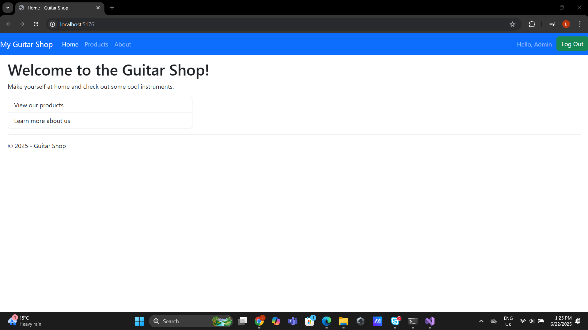

# My Guitar Shop Web Application

[](https://opensource.org/licenses/MIT)
[](https://dotnet.microsoft.com/en-us/download/dotnet/9.0)
[](https://learn.microsoft.com/en-us/ef/core/)

## Project Description

"My Guitar Shop" is a dynamic e-commerce web application I am currently developing, built using **ASP.NET Core 9.0 (MVC)** and **Entity Framework Core**. This project demonstrates my proficiency in designing and implementing a robust online retail platform with a focus on instrument sales, secure user management, and intuitive shopping experiences. It leverages modern architectural patterns and incorporates user authentication with personalized profiles, including avatar support.

## Screenshots

Here are some visual glimpses of the application's current state:

* **Welcome Page (Logged Out):**
    
* **Product List (All Products):**
    
* **About Us Page:**
    
* **User Registration Page (with Avatar Upload):**
    
* **Welcome Page (Logged In - User):**
    ![Welcome Page Logged In User])(Images/Screenshot2025-06-22132110.png)
* **Product List (Logged In - User):**
    
* **Welcome Page (Logged In - Admin):**
    
* **Product List (Logged In - Admin):**
    

## Features & Architectural Design

* **Product Catalog Management:**
    * Browse instruments by categories (Guitars, Basses, Drums, All).
    * Display product name, price, and "View Details" links.
    * **"Add to Cart" functionality** for authenticated users.
* **User Authentication & Personalization:**
    * Secure **User Registration** with fields for Username, Email, Password.
    * **Avatar Upload:** Users can upload a personalized avatar image during registration, which is displayed upon login.
    * **User Login/Logout:** Standard secure authentication flow.
    * Personalized greeting upon login (e.g., "Hello, lukskalashs", "Hello, Admin").
* **Role-Based User Authorization:**
    * Implemented robust **user authorization** to control access to specific functionalities based on assigned roles (e.g., distinguishing between regular users and "Admin" users).
* **Core Architectural Patterns:**
    * **Repository Pattern:** Utilized to abstract the data layer, ensuring clear separation of concerns, promoting loose coupling, and enhancing testability.
    * **Unit of Work (UoW):** Implemented to manage atomic transactions across multiple repository operations, guaranteeing data consistency.
* **Intuitive User Interface & Navigation:**
    * Clear top navigation menu: Home, Products, About.
    * Register/Login/Logout links for user session management.
* **Scalable Architecture:** Built on ASP.NET Core 9.0 (MVC) with Entity Framework Core for efficient and robust data persistence.

## Technologies Used

* **Backend Framework:** ASP.NET Core 9.0 (MVC)
* **ORM:** Entity Framework Core
* **Database System:** SQL Server
* **Frontend:** HTML, CSS, JavaScript, Bootstrap and FontAwesome
* **Version Control:** Git, GitHub

## Getting Started

### Prerequisites

* [.NET SDK 9.0 or higher](https://dotnet.microsoft.com/download/dotnet/9.0)
* A code editor (e.g., Visual Studio 2022, VS Code)
* SQL Server / SQL Lite

### Installation and Setup

1.  **Clone the repository:**
    ```bash
    git clone [https://github.com/](https://github.com/)[YOUR_GITHUB_USERNAME]/[YOUR_REPOSITORY_NAME].git
    cd [YOUR_REPOSITORY_NAME]
    ```
2.  **Configure Database Connection:**
    * Open `appsettings.json` (or `appsettings.Development.json`) and update the `ConnectionStrings` section to point to your local database instance.
        ```json
        "ConnectionStrings": {
          "DefaultConnection": "Server=(localdb)\\mssqllocaldb;Database=GuitarShop;Trusted_Connection=True;MultipleActiveResultSets=true"
        }
        ```
        *(Adjust the connection string as per your database setup.)*
3.  **Restore NuGet packages:**
    ```bash
    dotnet restore
    ```
4.  **Apply Database Migrations:**
    *(If you're using Entity Framework Core Migrations, ensure the `dotnet-ef` tool is installed: `dotnet tool install --global dotnet-ef`)*
    ```bash
    dotnet ef database update
    ```
5.  **Run the application:**
    ```bash
    dotnet run
    ```
    The application will typically launch at `https://localhost:[PORT_NUMBER]` (e.g., `https://localhost:5176`).

## Usage

* Browse products by navigating to the "Products" page.
* Use the category menu on the left to filter products.
* **Register** for a new account via the "Register" link to enable "Add to Cart" functionality and personalize your profile with an avatar.
* **Log in** to access your user session and see your personalized greeting.
* Explore admin functionalities if logged in as an administrator.

## Future Development

I am actively working on extending the application's capabilities. Key areas for future development include:

* Full shopping cart and checkout process implementation.
* Admin dashboard for managing products, categories, and orders.
* Enhanced product detail pages with richer content and images.
* And more....

## Contributing

Contributions are welcome! If you have suggestions or would like to contribute:

1.  Fork the repository.
2.  Create your feature branch (`git checkout -b feature/AmazingFeature`).
3.  Commit your changes (`git commit -m 'Add some AmazingFeature'`).
4.  Push to the branch (`git push origin feature/AmazingFeature`).
5.  Open a Pull Request.

## License

This project is licensed under the [MIT License](https://opensource.org/licenses/MIT). See the `LICENSE` file for details.

## Contact

* **Name:** Lukhanyo Kalashe
* **Email:** kalashslukhanyo@gmail.com
* **LinkedIn:** [https://www.linkedin.com/in/lukhanyo-kalashe-55320b22a/](https://www.linkedin.com/in/lukhanyo-kalashe-55320b22a/)

## Acknowledgments

* This project is a personal implementation demonstrating skills in ASP.NET Core web development.
* Built as part of my learning and portfolio development.
